Project 1: Designing Nav2 Controller and Planner Plugins
==============

***EE4308 Autonomous Robot Systems***

**&copy; National University of Singapore**

# Table of Contents
[1&emsp;Administrative Matters](#1administrative-matters)

[&emsp;1.1&emsp;Submittables](#11submittables)

[&emsp;1.2&emsp;Robot Loaning and Testing](#12robot-loaning-and-testing)

[2&emsp;Regulated Pure Pursuit](#2regulated-pure-pursuit)

[&emsp;2.1&emsp;Relevant Files for Controller](#21relevant-files-for-controller)

[&emsp;2.2&emsp;Implement `computeVelocityCommands()`](#22implement-computevelocitycommands)

[3&emsp;A* Path Planning and Savitsky-Golay Smoothing](#3a-path-planning-and-savitsky-golay-smoothing)

[&emsp;3.1&emsp;Relevant Files for Planner](#31relevant-files-for-planner)

[&emsp;3.2&emsp;Implement `createPlan()`](#32implement-createplan)

[4&emsp;Physical Experiments](#4physical-experiments)

[&emsp;4.1&emsp;Playing Field Demonstration](#41playing-field-demonstration)

[&emsp;4.2&emsp; Turning on the Turtlebot for the First Time](#42-turning-on-the-turtlebot-for-the-first-time)

[&emsp;4.3&emsp;Change `ROS_DOMAIN_ID` on Turtlebot and Remote PC](#43change-ros_domain_id-on-turtlebot-and-remote-pc)

[&emsp;4.4&emsp;Connect Turtlebot to Wi-Fi](#44connect-turtlebot-to-wi-fi)

[&emsp;4.5&emsp;Connect Remote PC to Wi-Fi](#45connect-remote-pc-to-wi-fi)

[&emsp;4.6&emsp;SSH into Turtlebot](#46ssh-into-turtlebot)

[&emsp;4.7&emsp;Running the Turtlebot Bringup](#47running-the-turtlebot-bringup)

[&emsp;4.8&emsp;Running the SLAM operation](#48running-the-slam-operation)

[&emsp;4.9&emsp;Testing the Navigation Plugins](#49testing-the-navigation-plugins)

[&emsp;4.10&emsp;Turn off Turtlebot](#410turn-off-turtlebot)


# 1&emsp;Administrative Matters
Take note of the deadline and install all relevant software before proceeding to the lab. This project requires Lab 1 to be completed.

| Overview | Description |
| -- | -- |
| **Effort** | Team of 3. |
| **Signup for Teams** | On Canvas People, P1 Teams. |
| **Signup Presentation Slots** | On Canvas People, P1P. |
| **Signup Lab Slots** | On Canvas People, P1 Lab. |
| **Deadline** | W7 Mon, 23:59. | 
| **Submission** | Submit a zip file, recorded presentation and demonstration video, and a report to the P1 Assignment on Canvas. More details below. |
| **Software** | Refer to Lab 1. |
| **Lab Computers**| Refer to Lab 1. |

## 1.1&emsp;Submittables
For all filenames, label as `p1_team##` (**lowercase**), where `##` is the double-digit team number (e.g. for team 7, it is `p1_team07`). Submit the following files to the P1 assignment group.

| Component | Description |
| --- | --- |
| P1C | Zip the `ee4308/src` folder into `p1_team##.zip`. A well-programmed code is highly readable. Highly readable code consist of judicious comments, proper indentation, appropriately named variables, and minimal code. There is deliberate thought in considering the effects of every piece of code, such that possible bugs are prevented, and a balance between readability and optimization is achieved. |
| P1R | A report `p1_team##.pdf`. **Do not include your names in the report, only the matric numbers**. About 10 to 15 pages excluding front-matter and back-matter. In a good report, the existing algorithms are examined in detail and simple solutions are proposed to significantly improve the algorithms. Deliberate comparisons are made to compare solutions, and advice is given based on realistic situations. Experiments and methodologies to tune parameters are well designed and justified. The narrative is concise and clear. Any figures, tables and references are labelled. There is a title page and content page, and the report is tidy and well organized.  |
| P1P | A recorded presentation and demonstration `p1_team##.mp4`. 6-min of presentation with slides, and 1-min of a sped-up physical robot demonstration. 8-min of Q&A will be conducted at the end of the video playback during the presentation slot. In a good presentation, the narrative is based primarily on the solutions and analyses. A detailed understanding of the concepts and related nuances are demonstrated with concise explanations. Summaries and diagrams are used for comparisons and advice. |

## 1.2&emsp;Robot Loaning and Testing
After programming and testing in simulation, the code has to be tested on a physical robot. Every team will be able to loan a robotic kit to test on a playing field in the lab. Three waypoints will be provided that the robot has to move to, and the physical run has to be filmed for the demonstration video.

Once the program is working in simulation,
1. Email the TA / GA for loaning the robotic kit on behalf of your team.
2. Select slots on Canvas People (P1 Lab) to book a lab session. First come first served. 
3. The robotic kit can be brought home. Return the robotic kit before the presentation.

# 2&emsp;Regulated Pure Pursuit

Improve upon Lab 1 by (i) implementing regulated pure pursuit, and (ii) ensuring that the robot can rotate to the desired orientation specified by the user. You may choose to implement further improvements to regulated pure pursuit.

Regulated pure pursuit is implemented on top of pure pursuit with the following heuristics:

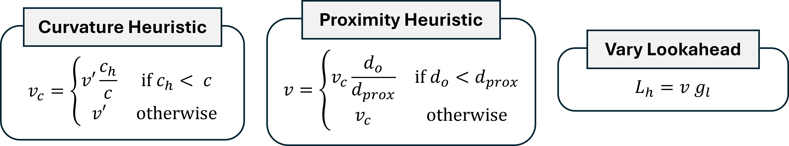

$c_h$, $d_{prox}$ and $g_l$ are the curvature threshold, proximity threshold, and lookahead gain respectively, and are user-defined constants. $v'$ is the linear velocity from the previous time-step, $d_o$ is the distance to the closest obstacle, and $L_h$ is the adjusted lookahead distance.

## 2.1&emsp;Relevant Files for Controller
Same as lab 1. `controller.cpp`, `controller.hpp`, and `proj1.yaml`.

## 2.2&emsp;Implement `computeVelocityCommands()`
The input and returned variables are almost the same as Lab 1. The additional requirements include (i) regulated pure pursuit and (ii) rotating to the user-defined goal orientation.

An *additional* input variable is:

| Input Variable | Type | Parameter | Description |
| --- | --- | --- | --- |
| `yaw_goal_thresh_` | `double` | Yes | Fixed at `0.25` radians. The difference in angle between the heading of the robot and the goal orientation. Stop the robot once the difference is smaller than the required value. |

The *minimal* pseudocode is:

1. **Function** computerVelocityCommands()
2. &emsp;**If** no global path **Then** 
3. &emsp;&emsp;**Return** $(0, 0)$ &emsp;&#x25B6; *Zero linear and angular velocities.* 
4. &emsp;**End If**
5. &emsp;**If** the robot is close to the goal **Then** &emsp;&#x25B6; *Goal is the last point on the path.* 
6. &emsp;&emsp;**If** the robot's heading far from the goal orientation **Then**
7. &emsp;&emsp;&emsp; **Return** $(0, \omega_0)$ &emsp;&#x25B6; *Choose a value for* $\omega_0$.
8. &emsp;&emsp;**End If**
9. &emsp;&emsp;**Return** $(0, 0)$
10. &emsp;**End If**
11. &emsp;Find the point along the path that is closest to the robot. 
12. &emsp;From the closest point, find the lookahead point.
13. &emsp;Transform the lookahead point into the robot frame to get $(x',y')$.
14. &emsp;Calculate the curvature $c$.
15. &emsp;Calculate $\omega$ from $v$ and $c$.
16. &emsp;Calculate the curvature heuristic. &emsp;&#x25B6; *Reg. Pure Pursuit.* 
17. &emsp;Calculate the obstacle heuristic. &emsp;&#x25B6; *Reg. Pure Pursuit.* 
18. &emsp;Vary the lookahead. &emsp;&#x25B6; *Reg. Pure Pursuit.* 
19. &emsp;Constrain $\omega$ to within the largest allowable angular speed.
20. &emsp;Constrain $v$ to within the largest allowable linear speed.
21. &emsp;**Return** $(v, \omega)$
22. **End Function**

A subscriber to the laser scan topic is required to implement the obstacle heuristic. 


# 3&emsp;A* Path Planning and Savitsky-Golay Smoothing
Implement A* in the Nav2 planner plugin to find a path around obstacles, and implement the Savitsky-Golay smoother. You may choose to improve A* by introducing post-processing or converting to multi-cost Theta*. The pseudocode for A* is provided in a later section.

Savitsky-Golay smoothing is done by fitting a polynomial curve over a moving window of regularly-spaced points of a path.
The points generated by A* can be considered regularly-spaced, while interpolation is necessary for Theta* to ensure regular spacing.

Let $\mathbf{J}$ be the Vandermonde matrix, which has $(2m+1)$ rows and $(p+1)$ columns. 
$m$ is the half-window size and $p$ is the polynomial order. 
For example, to fit a cubic curve over a window of 9 points, $m=4$ and $p=3$.
Every element $j_{r,c}$ in $\mathbf{J}$ is $j_{r,c} = (-m + r - 1)^{c-1}$. 
For example, in the second row and third column, the value $j_{2,3}=(-m+1)^{2}$.
Keep in mind that $r$ and $c$ starts from $1$ while indices in programming start from $0$.

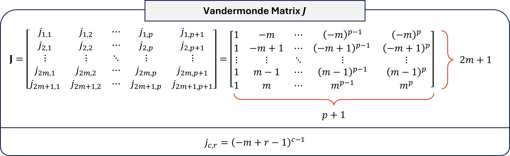

Let $\mathbf{A} = (\mathbf{J}^\top \mathbf{J})^{-1}\mathbf{J}^\top$ which is the kernel of the polynomial fit.
Obtain the first row $\mathbf{A}_{1,:}$ of $\mathbf{A}$.

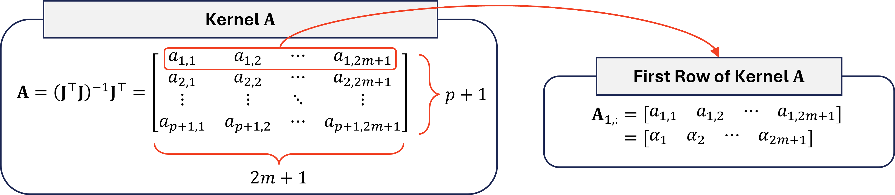

Suppose $x_i$ is a coordinate of the $i$-th point along a path with $n$ points.
The $i$-th smoothed point $\hat{x}_i$ is calculated as follows:

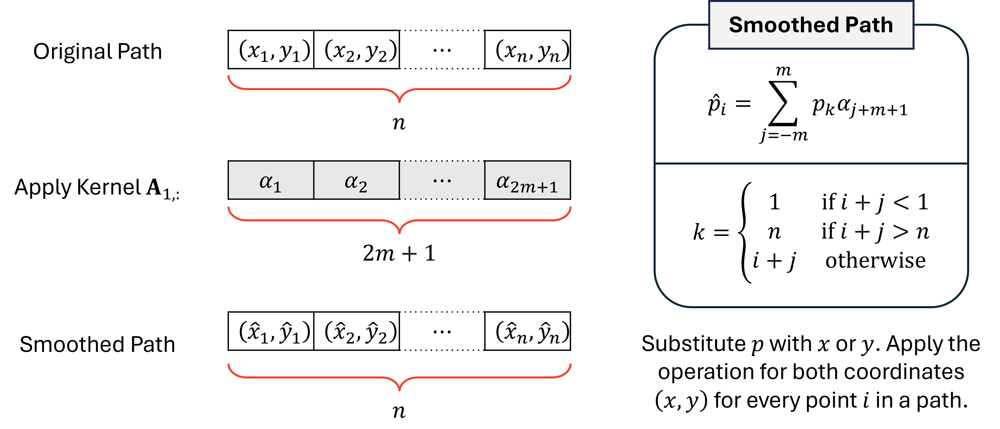

## 3.1&emsp;Relevant Files for Planner
From the same packages as lab 1, the `planner.cpp`, `planner.hpp`, and `proj1.yaml` files.

## 3.2&emsp;Implement `createPlan()`
Implement A* within `createPlan()`.

The following input variables are accessible by the function and *must* be used. 
| Input Variable | Type | Parameter | Description |
| --- | --- | --- | --- |
| `start` | `geometry_msgs::msg::PoseStamped` | No | Robot's current pose (position and orientation) in the world frame. |
| `goal` | `nav_msgs::msg::PoseStamped` | No | The goal pose (position and orientation) in the world frame. |
| `costmap_` | `nav2_costmap_2d::Costmap2D *` | No | Contains methods to interface with the occupancy grid, such as boundary checking, coordinate conversions, and cost queries. Costs range from 0 (free) to 255 (occupied). |
| `max_access_cost_` | `int` | Yes | To be tuned. The threshold to treat a cell as inaccessible and no paths should pass through the cell. |
| `sg_half_window_` | `int` | Yes | To be tuned. The half-window size $m$ of the Savitsky-Golay smoother. |
| `sg_order_` | `int` | Yes | To be tuned. The polynomial order $p$ of the Savitsky-Golay smoother. |
        
| Returns | Type | Description |
| --- | --- | --- |
| Path | `nav_msgs::msg::Path` | Use the provided `writeToPath()` function to return the path. |

The *minimal* pseudocode is:
1. **Function** astar()
2. &emsp;Initialize empty open-list.
3. &emsp;Initialize all nodes with $\infty$ $g$-cost and no parent.
4. &emsp;Initialize start node with $0$ $g$-cost.
5. &emsp;Queue start node into open-list.
6. &emsp;**While** open-list **not** empty **Do**
7. &emsp;&emsp; $n$ &larr; cheapest $f$-cost node polled from open-list.
8. &emsp;&emsp;**If** $n$ was previously expanded **Then**
9. &emsp;&emsp;&emsp;**Continue**
10. &emsp;&emsp;**Else If** $n$ is at goal **Then**
11. &emsp;&emsp;&emsp;Find a preliminary path by iterating from the $n$ to start node.
12. &emsp;&emsp;&emsp;Reverse the path so that the start is at the front of the path and goal is at the back.
13. &emsp;&emsp;&emsp;Convert the path from map coordinates to world coordinates.
13. &emsp;&emsp;&emsp;Apply Savitsky Golay smoothing to the path.
11. &emsp;&emsp;&emsp;**Return** path. 
12. &emsp;&emsp;**End If**
13. &emsp;&emsp;Mark $n$ as expanded.
14. &emsp;&emsp;**For** each accessible neighbor node $m$ of $n$ **Do**
15. &emsp;&emsp;&emsp; $\tilde{g}$ &larr; $g$-cost of $n$ $+$ (physical distance between $n$ and $m$) $\times$ (map cost at $m$)
16. &emsp;&emsp;&emsp;**If** $\tilde{g} <$ $g$-cost of $m$ **Then**
17. &emsp;&emsp;&emsp;&emsp; $g$-cost of $m$ &larr; $\tilde{g}$
18. &emsp;&emsp;&emsp;&emsp;parent of $m$ &larr; $n$
19. &emsp;&emsp;&emsp;&emsp;Queue $m$ into the open-list with the new $f$-cost of $m$.
20. &emsp;&emsp;&emsp;**End If**
21. &emsp;&emsp;**End For**
22. &emsp;**End While**
23. &emsp;**Return** no path.
30. **End Function**

You may refer to [tips.md](tips.md) for programming tips and useful functions.

# 4&emsp;Physical Experiments
Proceed with the hardware testing only when all the programming tasks are completed and tested to work in simulation, as there are limited lab slots available.
The robot kit has to be loaned (See []Section 1.2(#12robot-loaning-and-testing)).

## 4.1&emsp;Playing Field Demonstration
Teams are to map a physical playing field in lab using SLAM, and navigate to three waypoints using the custom planner and controller Nav2 plugins. 
A recorded video  (fast-forwarded to $2\times$ speed) of a successful run is to be played-back immediately after the presentation.

The details of the playing field will be released by Week 5, as the lab will open in Weeks 5, 6, and recess week. The playing field is approximately $5\times 5$ m and has narrow corridors that are about 40cm wide.

## 4.2&emsp; Turning on the Turtlebot for the First Time 
1. On the Turtlebot, connect to a monitor via a HDMI cable. 

    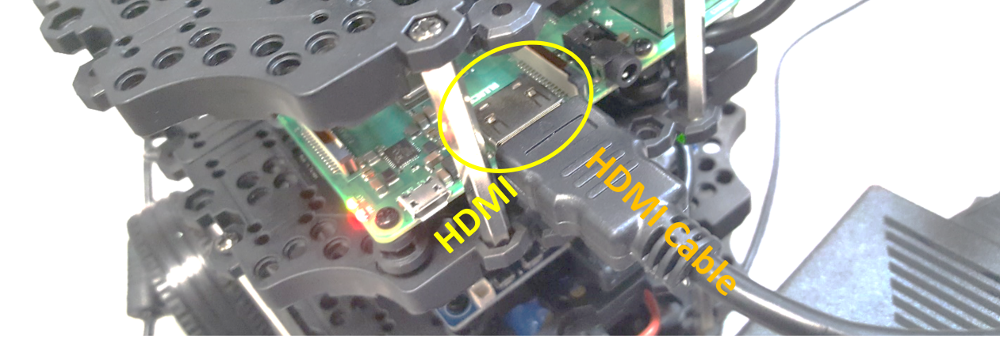

2. Connect a keyboard to the Turtlebot.

    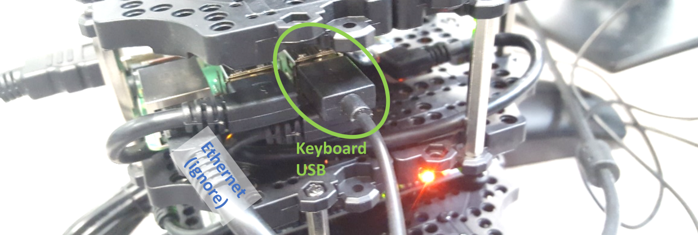

3. Connect the battery or the DC jack to the Turtlebot to power the robot.

    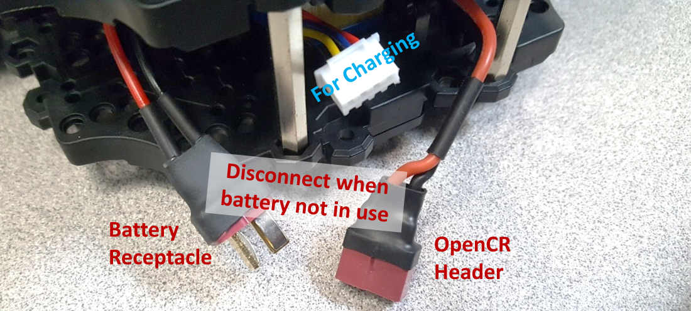
    
    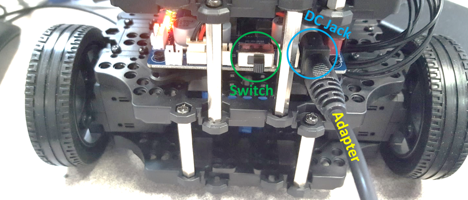

4. Turn on the robot by flipping the switch on the Turtlebot.

5. If successful, there should be a brief rainbow screen on the monitor and subsequently many lines of output. 
    The boot may fail occasionally, such that the rainbow screen is not shown. 
    Simply flip the switch on the Turtlebot twice to power off and on again.

6. Log in to the Turtlebot with the given **username** and **password**. 

## 4.3&emsp;Change `ROS_DOMAIN_ID` on Turtlebot and Remote PC
This section only needs to be done once.

1. On a logged-in Turtlebot (or PC, if you are repeating the steps), edit the `.bashrc` file.
    ```bash
    nano ~/.bashrc
    ```

2. Scroll all the way down to find a line that is `export ROS_DOMAIN_ID=`.

3. Set `export ROS_DOMAIN_ID=<team>`, where `<team>` is your team number. 
    For example, for team 7, `export ROS_DOMAIN_ID=7`. There should not be spaces beside `=`.

4. Press `Ctrl+S` and then `Ctrl+X` to save and exit.

5. Run the following:
    ```bash
    source ~/.bashrc
    ```
    
6. **Repeat all steps above** for the computer (remote PC) that will be connected to the Turtlebot.

## 4.4&emsp;Connect Turtlebot to Wi-Fi
The Turtlebot can only connect to a **non-NUS Wi-Fi** network.

1. On a logged-in Turtlebot, edit the network configuration file.
    ```bash
    sudo nano /etc/netplan/50-cloud-init.yaml
    ```

2. Key in the password for the Turtlebot if prompted.

3. Scroll down to find `access-points`. You can add multiple access points based on the following syntax:
    ```bash
    ...
    access-points:
      "<WIFI_SSID>":
        password: "WIFI_PASSWORD"
      "<WIFI_SSID2>":
        password: "<WIFI_PASSWORD2>"
    ```
    where the top-most access point is given priority.
    
4. Take note of the indentation in the file. In the example above, the indentation is two spaces. In some files, it can be four spaces. Only the indentation relative to `access-points` is shown.

5. Replace `<WIFI_SSID>` and `<WIFI_PASSWORD>`, such that if the Wi-Fi is `wifi1` and the password is `pass1`, and the indentation is two spaces,
    ```bash
    ...
    access-points:
      "wifi1":
        password: "pass1"
    ```
6. Press `Ctrl+S` and then `Ctrl+X` to save and exit.

7. Run the following to connect:
    ```bash
    sudo netplan apply
    ```

8. The following command may be run repeated to show the state of connection:
    ```bash
    networkctl
    ```
    `wlan0` will take about half a minute before `routable` and `configured` is seen, which means the Wi-Fi is successfully connected. 
    Otherwise, there may be firewall issues or the supplied `<WIFI_SSID>` or `<WIFI_PASSWORD>` is wrong.

9. Obtain the IP address of the Turtlebot `<TURTLE_IP>` with the following command:
    ```bash
    ip a
    ```

    Find the four-digit IP address under `wlan0`, excluding `/24`, as shown:

    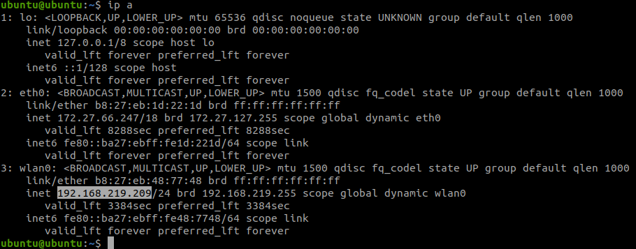

    The IP address can also be obtained if you have access to the mobile hotspot or router.

10. The Turtlebot will reconnect to the Wi-Fi if the robot is re-booted and the Wi-Fi is available. The IP address `<TURTLE_IP>` is typically the same between different sessions, but may occasionally change. If the IP address changes and cannot be found from the router, connect the monitor and keyboard in [Section 4.2](#42-turning-on-the-turtlebot-for-the-first-time) and log in to the robot. Run the command `ip a` to re-obtain the IP address.

## 4.5&emsp;Connect Remote PC to Wi-Fi

1. Connect your Remote PC to the same Wi-Fi as the Turtlebot, which should be a non-NUS Wi-Fi.
    The subsequent steps can be ignored if you are not using VirtualBox.

2. If using VirtualBox, you would need to additionally switch to a **bridged adapter**. On the VirtualBox window, click `Machine` and `Settings`.

    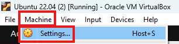

3. In the `Network` tab, in `Attached to`, select `Bridged Adapter`.

    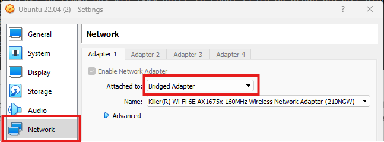

4. This will enable ROS2 communication between the Turtlebot and the PC. If the ROS2 communication does not work in subsequent sections, reboot Ubuntu in the VirtualBox while ensuring that the bridged adapter is selected.

5. The `Bridged Adapter` allows for ROS2 communication, but disables NUS network access. The opposite is true for `NAT`. Switch between the adapters depending on your needs.

## 4.6&emsp;SSH into Turtlebot
This section assumes both the Turtlebot and Remote PC are connected to the same non-NUS Wi-Fi.

1. Open a new terminal on your Remote PC.

2. Connect to the Turtlebot by running
    ```bash
    ssh ubuntu@<TURTLE_IP>
    ```
    where `<TURTLE_IP>` is the Turtlebot's IP address.

3. This enables access to the Turtlebot without connecting the keyboard and monitor. The caveat however is that the Turtlebot's IP address has to be known, and that the Turtlebot is connected to the Wi-Fi. 

4. To exit the SSH, run the command `exit` or press `Ctrl+D`. Do not exit if you are doing this section for this first time.

## 4.7&emsp;Running the Turtlebot Bringup
The Turtlebot bringup starts up the sensors, publishes sensor data into ROS2, and enables tele-operation. 

1. Remove the keyboard and monitor if they are connected to the Turtlebot.

2. Make sure that the battery or the DC jack is plugged in to the Turtlebot.

3. Place the robot on a flat surface.

4. On the **Turtlebot SSH terminal**, run the command to begin sensor calibration and bringup the robot. Do not touch or shake the robot until the `Run!` word is shown, as the Gyro sensor is calibrating.
    ```bash
    ros2 launch turtlebot3_bringup robot_c1.launch.py
    ```
5. You may now begin using the robot. To interrupt the program *later*, `Ctrl+C` can be used.

## 4.8&emsp;Running the SLAM operation
This section assumes that the Turtlebot and the Remote PC are connected to the same Non-NUS Wi-Fi,
the `ROS_DOMAIN_ID` for the robot and PC are the same ([Section 4.3](#43change-ros_domain_id-on-turtlebot-and-remote-pc)),
and if using VirtualBox, the network adapter is the bridged adapter ([Section 4.5](#45connect-remote-pc-to-wi-fi)).


1. Plug in the battery and remove any physical connections to the Turtlebot.

2. Make sure that the robot is placed at the origin point of a new area to map, and that the robot is pointing along the positive $x$-axis of the map.

3. Ensure that the Turtlebot bringup is running via SSH ([Section 4.7](#47running-the-turtlebot-bringup)).

4. On a **Remote PC terminal**, go to the workspace and launch the following:
    ```bash
    cd ~/ee4308
    source install/setup.bash
    ros2 launch ee4308_bringup proj1_slam.launch.py
    ```

5. On another **Remote PC terminal**, run the teleoperation:
    ```bash
    ros2 run turtlebot3_teleop teleop_keyboard
    ```

6. Begin mapping the area like in the simulations.

7. Once the area is mapped, interrupt the remote PC terminal running the teleoperation with `Ctrl+C`.

8. In the same terminal, save the map with:
    ```bash
    ros2 run nav2_map_server map_saver_cli -f ~/ee4308/src/ee4308_bringup/maps/my_map
    ```

9. After the map is saved, install the map by building the workspace:
    ```bash
    cd ~/ee4308
    colcon build --symlink-install
    ```

10. All terminals can now be interrupted with `Ctrl+C`.

## 4.9&emsp;Testing the Navigation Plugins
This section assumes that the Turtlebot and the Remote PC are connected to the same Non-NUS Wi-Fi,
and the `ROS_DOMAIN_ID` for the robot and PC are the same ([Section 4.3](#43change-ros_domain_id-on-turtlebot-and-remote-pc)).
If using VirtualBox, the network adapter should be set to the bridged adapter ([Section 4.5](#45connect-remote-pc-to-wi-fi)).
In addition, the map must have been obtained via SLAM ([Section 4.8](#48running-the-slam-operation)).

1. Plug in the battery and remove any physical connections to the Turtlebot.

2. Place the Turtlebot in a part of the map where you want to start it.

3. Ensure that the Turtlebot bringup is running via SSH ([Section 4.7](#47running-the-turtlebot-bringup)).

4. On a **Remote PC terminal**, go to the workspace and launch the following:
    ```bash
    cd ~/ee4308
    source install/setup.bash
    ros2 launch ee4308_bringup proj1.launch.py
    ```

5. Estimate the initial pose in RViz with `2D Pose Estimate`.

6. Test your software by sending `Nav2 Goal`. `Ctrl+C` when done.

If the code can work well in simulation, it will work well with hardware. 
If your program is too slow or troubleshooting is required, refer to [tips.md](tips.md) for some tips.

## 4.10&emsp;Turn off Turtlebot
1. Run the following on the Turtlebot SSH terminal or on the Turtlebot to turn off the robot:
    ```bash
    sudo shutdown now
    ```
    If running from the SSH terminal, the connection will close.

2. Wait for a few seconds until the lights on the Raspberry Pi stops blinking.

3. Flip the switch on the Turtlebot to turn off.